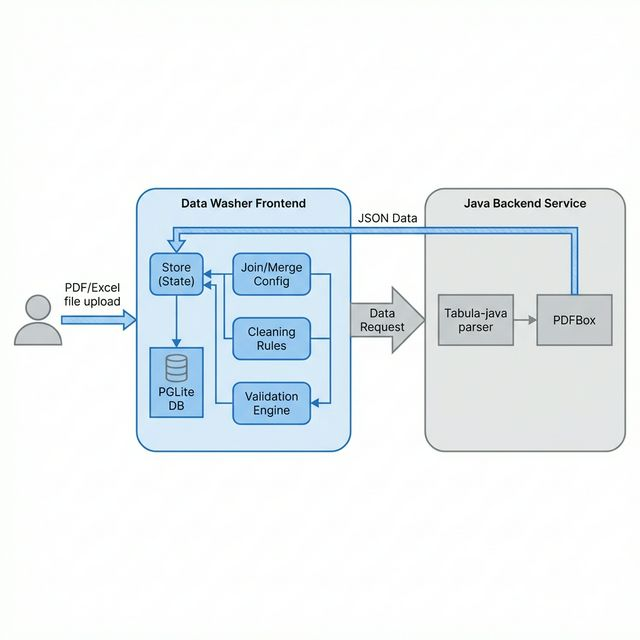
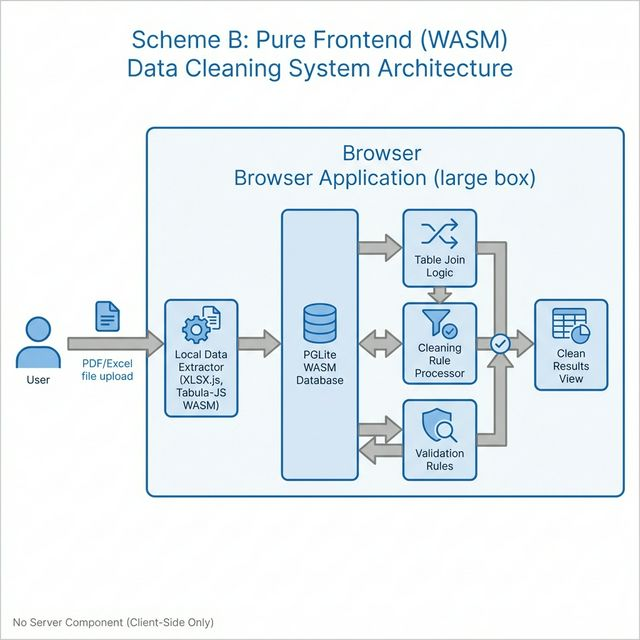

# Data Washer 技术架构与 PDF 集成方案说明

## 1. 当前前端架构概述 (Current Architecture)

本项目采用了“基于浏览器内数据库”的声明式数据预处理架构，核心逻辑运行在客户端，确保了数据的私密性与极速响应。

### 核心组件层级：
*   **存储层 (Core Store)**：基于简单的 `State` 模式，管理全局配置（字段、清洗规则、校验规则）和原始数据。
*   **计算层 (Execution Engine)**：
    *   **SQL 引擎**：集成 `PGLite` (WASM)，将清洗规则（Transform）和合并逻辑（Join）转换为标准 SQL 语句在浏览器内执行。
    *   **验证 Registry**：管理字段校验逻辑，支持表达式转换 (JS Code Gen) 和脚本执行 (Eval)。
*   **UI 组件层 (Components)**：采用 Vanilla JS + 事件驱动模式。
    *   `FieldPanel`: 字段配置、清洗逻辑选择。
    *   `ValidationPanel`: 表达式可视化构建器。
    *   `PreviewPanel`: 渲染基于 PGLite 执行结果的实时表格，提供错误/警告高亮。
*   **适配层 (Adapter)**：使用 `XLSX.js` 处理 Excel 的二进制解析。

---

## 2. 方案 A：前端 + Java 后端集成 (Tabula-java)

此方案利用 Java 在 PDF 处理上的稳定性及 Tabula 算法 the 成熟度。

**技术链路解析**：
1.  **解析端**：Java 后端接收文件，通过 Tabula-java 解析 PDF 表格物理坐标。
2.  **数据中转**：解析结果序列化为标准化 JSON 数据流返回给前端 `Store`。
3.  **前端核心流程**：
    *   **载入与预览**：数据存入 `PGLite` 初始化原始表，并在 `Preview` 面板展示。
    *   **规则应用**：用户配置的“清洗规则”与“表格合并逻辑”被编译为 SQL。
    *   **校验与输出**：SQL 在 `PGLite WASM` 中执行，生成最终清洗结果字段并触发校验引擎。

---

## 3. 方案 B：纯前端方案 (Tabula-JS / WASM)

此方案追求极致的本地化，无需后端服务。

**技术链路解析**：
1.  **本地提取**：前端直接调用 `Tabula-JS (WASM)` 识别 PDF 文本坐标。
2.  **内存管道**：通过 `pdf.js` 获取行列对齐规律，直接在浏览器内存中生成 Row Objects 并存入 `PGLite`。
3.  **全链路清洗**：所有 SQL 执行、合并逻辑生成以及结果字段校验均在浏览器沙箱内完成，不涉及网络传输。

**特点**：
*   **优势**：数据 100% 留在用户电脑（零泄露风险）；部署成本极低（纯静态文件）。
*   **适用**：数据极其敏感、预算受限或希望极致便携的场景。

---

## 4. 数据标准化协议 (Data Standard)

为了让后续的清洗流程（Excel/PDF 通用），解析出的表格必须遵循以下标准化协议：

| 字段 | 说明 |
| :--- | :--- |
| **数组格式** | `Array<Object>`，每个对象代表一行。 |
| **键名规范** | 使用原始列名或生成的唯一别名，作为后续 SQL 操作的物理别名。 |
| **元数据维护** | 保留页码、提取置信度等元数据辅助清洗脚本决策。 |

---

## 总结：如何选择？
*   如果您追求 **“精准度第一”** 且已有 Java 后端基础设施，推荐 **方案 A**。
*   如果您追求 **“零部署成本”** 且 PDF 格式相对规整，推荐 **方案 B**。
